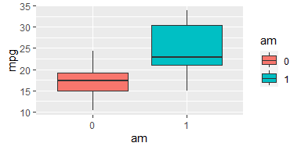
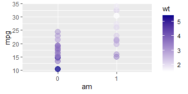
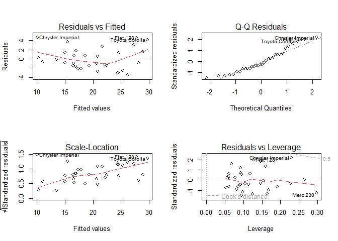

# Regression Models Course Project

## Executive Summary

Looking at a data set `mtcars`, this project explored the relationship
between transmission type and miles per gallon (MPG) (outcome) using
linear models. It was found that manual transmissions have, on average,
**2.94** miles per gallon **increase** over automatic transmissions.

## Exploratory Analysis

`mtcars` has 32 observations of 11 numeric variables. From the
documentation, the `am` variable represents the transmission type, where
0 and 1 correspond to automatic and manual transmission respectively.
The variables `vs`, `am`, and `gear` are considered as factors. See
appendix for the structure of `mtcars`.

Also in the appendix, an initial boxplot of mpg by transmission type
shows that manual cars appear to have higher mpg on average compared to
automatics. However, there are other variables to consider that would
affect mpg. As an example, the appendix has scatterplot of mpg vs
transmission, but the points are coloured by the weight of the car.

## Regression and Statistical Inferences

### Simple Linear Model

First, use a simple linear regression model with `am` as a regressor.

``` r
fit1 <- lm(mpg ~ am, mtcarsfactored)
round(summary(fit1)$coef,2)
```

    ##             Estimate Std. Error t value Pr(>|t|)
    ## (Intercept)    17.15       1.12   15.25        0
    ## am1             7.24       1.76    4.11        0

``` r
round(summary(fit1)$r.squared,2)
```

    ## [1] 0.36

The `Intercept`, 17.15, is interpreted as the mean `mpg` for automatic
cars, and the coefficient for `am1`, 7.25, represents the change in mean
`mpg` for manual cars from the `Intercept`. The p-values for both are
below an alpha level of 5%, thus are considered statistically
significant. However, the R-squared value is around 0.36, thus the model
only explains about 36% of the total variability.

### Multivariable Linear Models and Selection

The `step()` function returns a model with the most statistically
relevant regressors, while balancing over and under-fitting the data.

``` r
stepfit <- step(lm(mpg~.,mtcarsfactored), trace = 0)
coef(stepfit)
```

    ## (Intercept)          wt        qsec         am1 
    ##    9.617781   -3.916504    1.225886    2.935837

According to the `step()` function, the variables with the highest
statistical significance to `mpg` are `am`, `wt`, and `qsec`.

### Statistical Inferences and Analysis of `stepfit` model

The residuals vs fitted values plot of `stepfit` shows no correlation,
and the Normal Q-Q plot indicates the distribution of residuals is
approximately normal. Both plots are in the appendix.

Looking at the summary of `stepfit`:

``` r
summary(stepfit)
```

    ## 
    ## Call:
    ## lm(formula = mpg ~ wt + qsec + am, data = mtcarsfactored)
    ## 
    ## Residuals:
    ##     Min      1Q  Median      3Q     Max 
    ## -3.4811 -1.5555 -0.7257  1.4110  4.6610 
    ## 
    ## Coefficients:
    ##             Estimate Std. Error t value Pr(>|t|)    
    ## (Intercept)   9.6178     6.9596   1.382 0.177915    
    ## wt           -3.9165     0.7112  -5.507 6.95e-06 ***
    ## qsec          1.2259     0.2887   4.247 0.000216 ***
    ## am1           2.9358     1.4109   2.081 0.046716 *  
    ## ---
    ## Signif. codes:  0 '***' 0.001 '**' 0.01 '*' 0.05 '.' 0.1 ' ' 1
    ## 
    ## Residual standard error: 2.459 on 28 degrees of freedom
    ## Multiple R-squared:  0.8497, Adjusted R-squared:  0.8336 
    ## F-statistic: 52.75 on 3 and 28 DF,  p-value: 1.21e-11

The multiple R-squared value indicates that this model accounts for
about 85% of the total variation. The coefficient for `am1` shows an
increase of 2.94 in mean `mpg` for a manual transmission compared to an
automatic, holding the other regressors fixed. The p-value of `am1` is
less than an alpha level of 5%, thus it can be said that the difference
in mean `mpg` between automatic and manual cars is statistically
significant.

The 95% confidence interval for the `am1` coefficient is:

``` r
confint(stepfit)['am1',]
```

    ##      2.5 %     97.5 % 
    ## 0.04573031 5.82594408

With 95% confidence, a manual transmission will see an increase of 0.05
to 5.83 miles per gallon over an automatic transmission, while holding
other regressors fixed.

## Appendix

### Libraries

``` r
library(ggplot2); library(dplyr)
```

### Structure of mtcars

    ## 'data.frame':    32 obs. of  11 variables:
    ##  $ mpg : num  21 21 22.8 21.4 18.7 18.1 14.3 24.4 22.8 19.2 ...
    ##  $ cyl : num  6 6 4 6 8 6 8 4 4 6 ...
    ##  $ disp: num  160 160 108 258 360 ...
    ##  $ hp  : num  110 110 93 110 175 105 245 62 95 123 ...
    ##  $ drat: num  3.9 3.9 3.85 3.08 3.15 2.76 3.21 3.69 3.92 3.92 ...
    ##  $ wt  : num  2.62 2.88 2.32 3.21 3.44 ...
    ##  $ qsec: num  16.5 17 18.6 19.4 17 ...
    ##  $ vs  : num  0 0 1 1 0 1 0 1 1 1 ...
    ##  $ am  : num  1 1 1 0 0 0 0 0 0 0 ...
    ##  $ gear: num  4 4 4 3 3 3 3 4 4 4 ...
    ##  $ carb: num  4 4 1 1 2 1 4 2 2 4 ...

### Initial boxplot of mpg vs transmission



### mpg vs transmission and cylinders



The scatterplot shows a negative correlation between mpg and weight;
naturally, heavier cars have worse mpg regardless of transmission.

### Correlation Calculation

``` r
round(cor(mtcars),3)[1,]
```

    ##    mpg    cyl   disp     hp   drat     wt   qsec     vs     am   gear   carb 
    ##  1.000 -0.852 -0.848 -0.776  0.681 -0.868  0.419  0.664  0.600  0.480 -0.551

### Residual Plots

``` r
par(mfrow = c(2, 2))
plot(stepfit)
```


